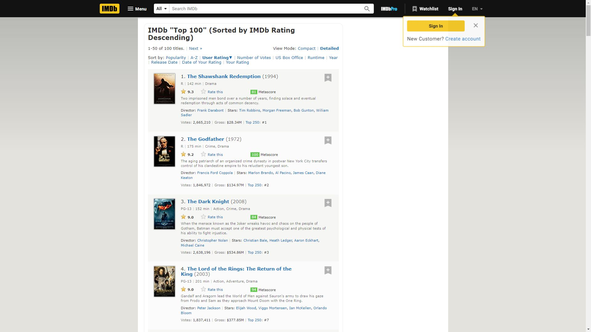
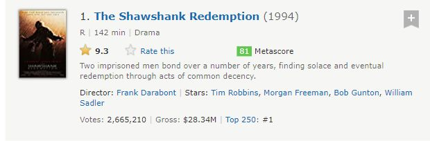
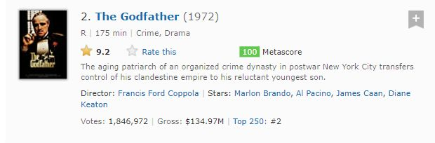
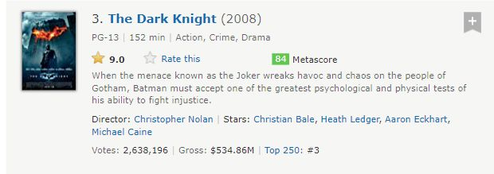

# Puppeteer each div screenshot

Example of how to take a screenshot of each HTML block using puppeteer and sharp
I was using https://www.imdb.com/ for example

### Initial page screenshot

### Cropped divs

